# ⚾ KBO 굿즈 쇼핑몰

KBO(한국프로야구) 구단 굿즈를 사고파는 온라인 쇼핑몰입니다. Spring Boot 백엔드와 React 프론트엔드로 구성된 풀스택 토이 프로젝트입니다.

## 주요 기능

- 회원가입 / 로그인 (JWT 기반 인증), 회원 탈퇴
- 구단 · 카테고리별 상품 필터링, 상품 검색, 위시리스트(찜)
- 상품 상세: 리뷰(별점 · 후기) 작성/수정/삭제, 유니폼 옵션(사이즈 · 마킹) 선택
- 장바구니 및 주문/결제(Checkout), 회원 등급별 쿠폰 발급 및 적용, 적립금 사용/적립
- **실결제 테스트 연동**: 카카오페이·토스페이먼츠 테스트(샌드박스) 결제 — 결제 준비(ready/prepare) → 결제창/위젯 → 승인(approve/confirm) 흐름을 실제 PG API로 처리하고, 승인이 끝난 뒤에야 주문이 생성된다. PG 승인은 성공했지만 주문 생성이 실패하는 경우를 대비한 정합성 배치가 주기적으로 재시도하고, 계속 실패하면 PG 결제를 자동 취소(환불)한다
- 배송지 저장/관리 — 다음(Daum) 우편번호 서비스로 주소 검색, 기본 배송지 지정, 주문/결제 화면 및 마이페이지에서 저장된 배송지 자동입력/관리
- 홈 화면 광고 배너 캐러셀
- 마이페이지 (`/mypage` 하위 라우팅): 응원 구단 선택, 주문/배송 조회(기간별 필터), 취소/반품 내역, 쿠폰함, 적립금 내역(기간별 필터), 위시리스트, 내가 쓴 리뷰/리뷰 작성 대상 확인, 배송지 관리
- 관리자 페이지 (`/admin` 하위 라우팅): 상품 관리(재고 · 판매상태 · 상세이미지 수정), 카테고리/뱃지 관리(등록 · 수정 · 삭제), 회원 관리(회원 상세 정보 모달 포함), 주문 상태 관리(상태별 필터, 송장번호 입력), 쿠폰 발급, 배너 관리, 통계/매출 대시보드(기간별 매출 추이 · 구성 차트) — 모두 관리자 권한 필요
- 상품 이미지 업로드 (Supabase Storage)
- Postgres RLS(Row Level Security) 기반 DB 접근 제어: 런타임 전용 제한 계정과 마이그레이션 소유자 계정을 분리
- 라이트 / 다크 테마 지원

## 기술 스택

**Backend**
- Java 17, Spring Boot 4
- Spring Security (JWT 인증), Spring Data JPA
- PostgreSQL (Supabase) + Row Level Security, Flyway로 스키마 버전 관리
- Supabase Storage (상품/배너 이미지 업로드)
- 카카오페이 Open API, 토스페이먼츠 결제 API 연동 (테스트/샌드박스 키)

**Frontend**
- React 19, TypeScript, Vite
- React Router, TanStack Query, Axios
- 토스페이먼츠 결제위젯 SDK(`@tosspayments/payment-widget-sdk`), 다음(Daum) 우편번호 서비스
- CSS Modules

## 화면

| 홈 | 상품 목록 |
| --- | --- |
| 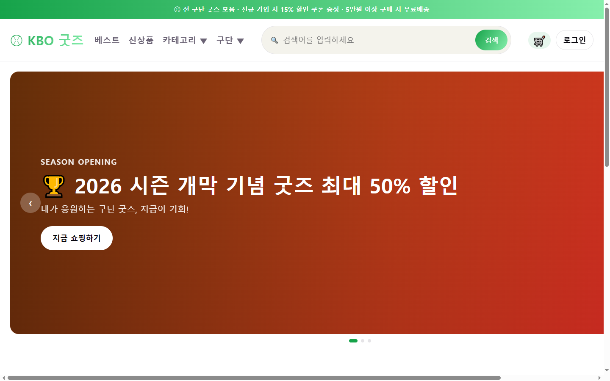 | 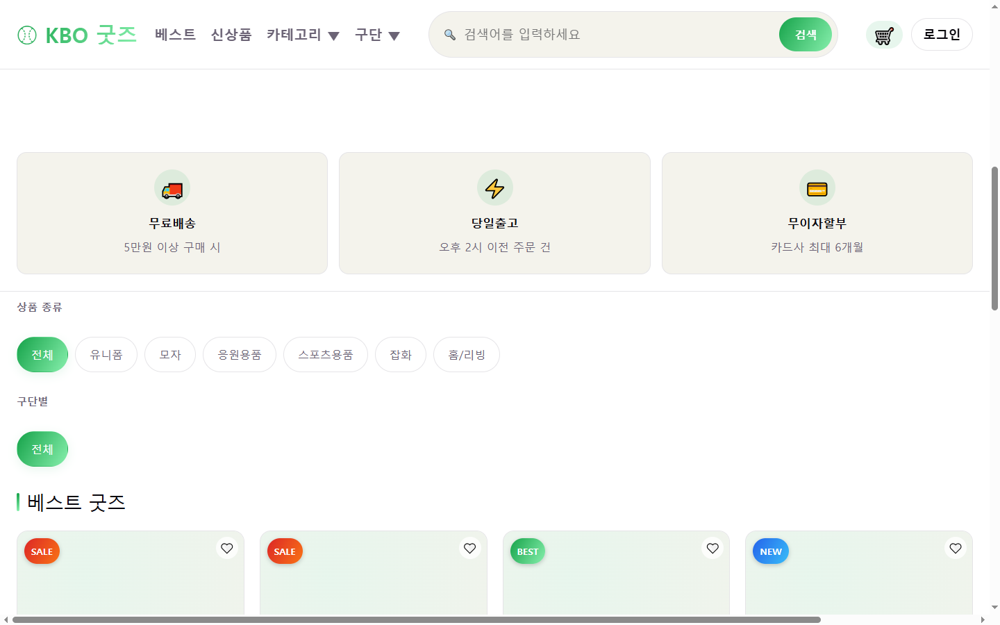 |

| 상품 검색 | 장바구니 |
| --- | --- |
| 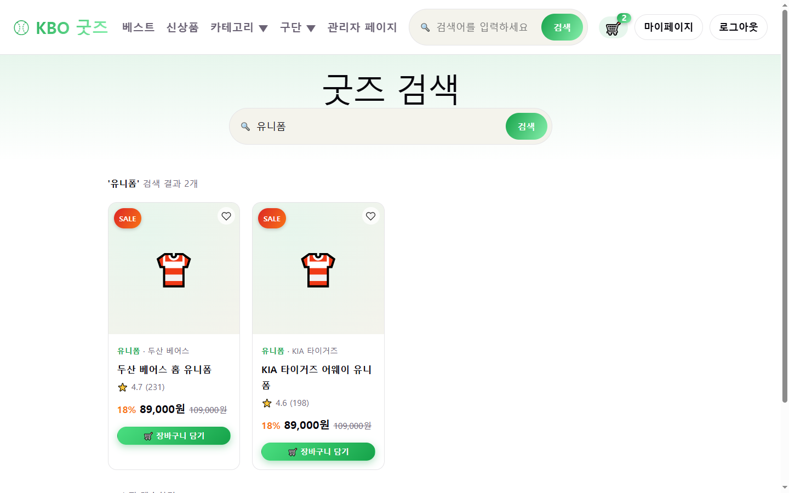 | 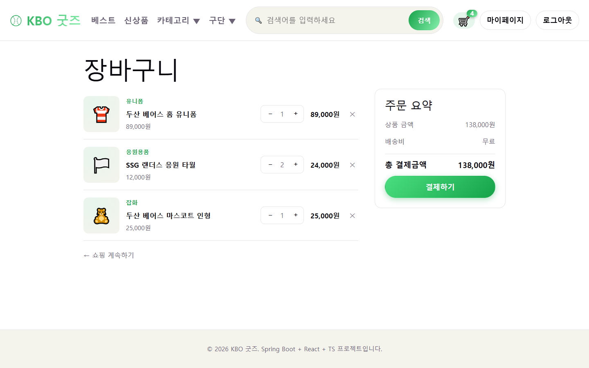 |

| 상품 상세 (리뷰) | 주문/결제 |
| --- | --- |
| 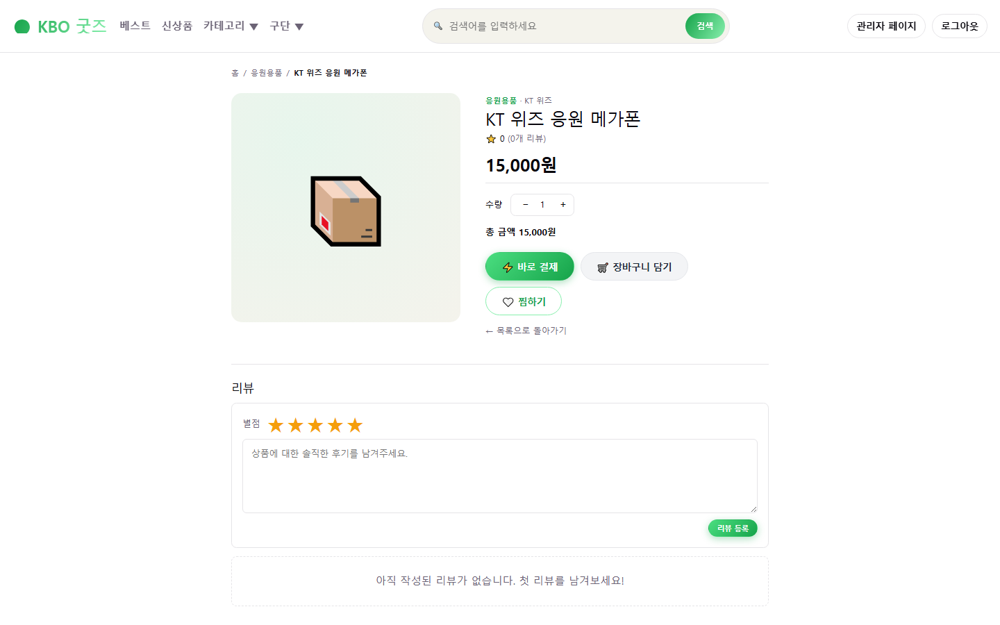 | 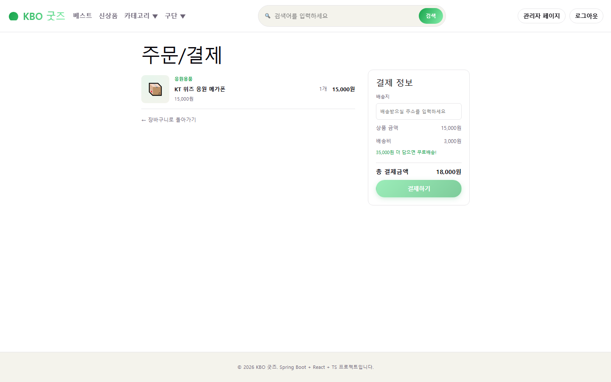 |

| 마이페이지 (응원팀 선택) | 관리자 - 상품 관리 |
| --- | --- |
| 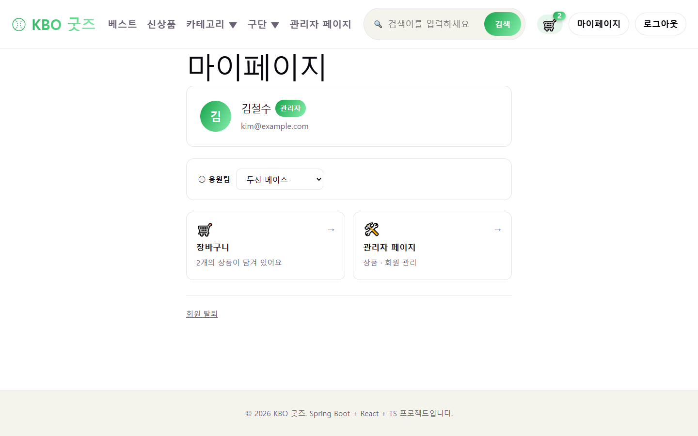 | 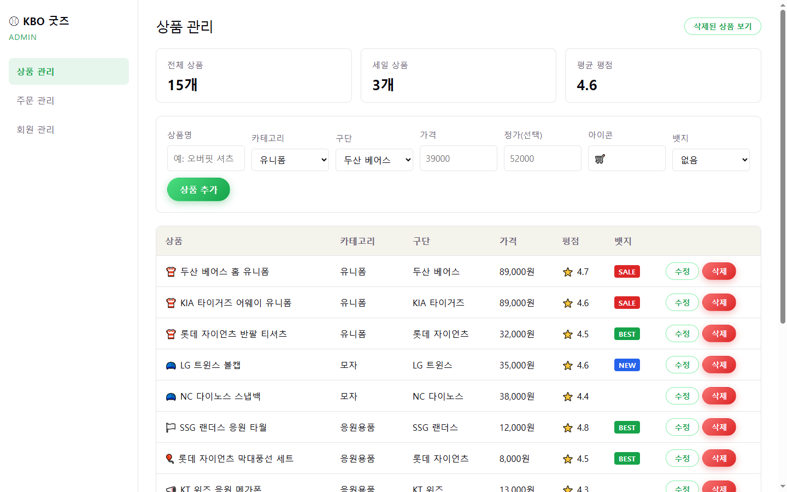 |

| 관리자 - 카테고리/뱃지 관리 | 관리자 - 배너 관리 |
| --- | --- |
| 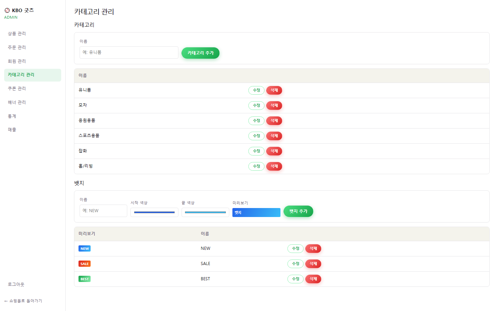 | 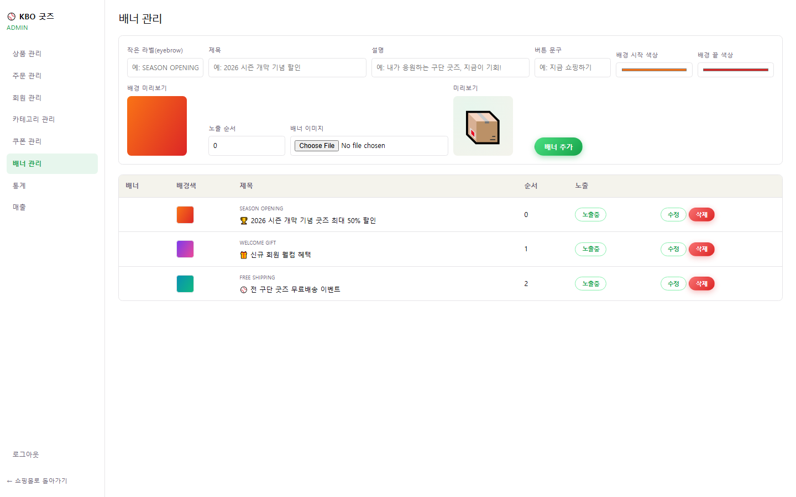 |

| 관리자 - 쿠폰 관리 | 관리자 - 매출 대시보드 |
| --- | --- |
| 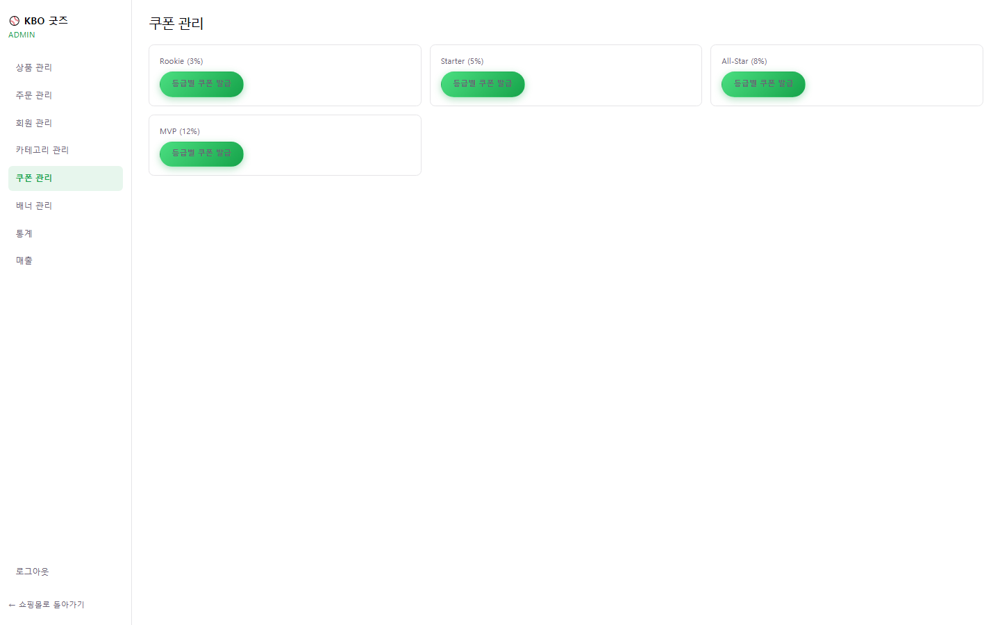 | 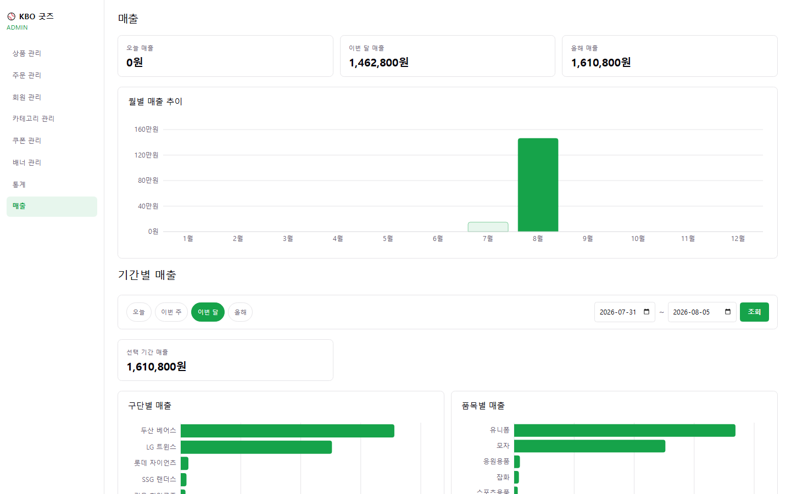 |

### 데모 계정

| 이메일 | 비밀번호 | 권한 |
| --- | --- | --- |
| kim@example.com | password123 | ADMIN |
| lee@example.com | password123 | USER |
| park@example.com | password123 | USER |
